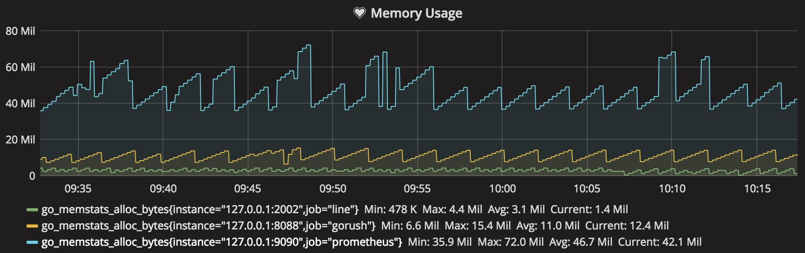
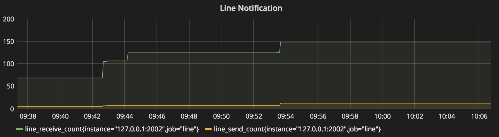

# drone-line

[](https://godoc.org/github.com/appleboy/drone-line)
[](http://drone.wu-boy.com/appleboy/drone-line)
[](https://codecov.io/gh/appleboy/drone-line)
[](https://goreportcard.com/report/github.com/appleboy/drone-line)
[](https://hub.docker.com/r/appleboy/drone-line/)
[](https://microbadger.com/images/appleboy/drone-line "Get your own image badge on microbadger.com")
[](https://github.com/appleboy/drone-line/releases/latest)

Sending line notifications using a binary, docker or [Drone CI](http://readme.drone.io/0.5/).

## Register Line BOT API Trial

Please refer to [LINE Business Center](https://business.line.me/en/services/bot).

## Feature

* [x] Send multiple Message.
* [x] Send Text Message.
* [x] Send Video Message.
* [x] Send Audio Message.
* [x] Send Sticker Message.
* [x] Send Location Message.
* [x] Support [prometheus](https://prometheus.io) metrics API.
* [x] Automatically install TLS certificates from [Let's Encrypt](https://letsencrypt.org/).
* [x] Support [Localtunnel](https://localtunnel.github.io/www/) for webhook tunnel.

> Localtunnel allows you to easily share a web service on your local development machine without messing with DNS and firewall settings.

Memory Usage:

[]

Notification Count Usage:

[]

## Build or Download a binary

The pre-compiled binaries can be downloaded from [release page](https://github.com/appleboy/drone-line/releases). Support the following OS type.

* Windows amd64/386
* Linux amd64/386
* Darwin amd64/386

With `Go` installed

```
$ go get -u -v github.com/appleboy/drone-line
``` 

or build the binary with the following command:

```
$ make build
```

## Docker

Build the docker image with the following commands:

```
$ make docker
```

Please note incorrectly building the image for the correct x64 linux and with
CGO disabled will result in an error when running the Docker image:

```
docker: Error response from daemon: Container command
'/bin/drone-line' not found or does not exist..
```

## Usage

There are three ways to send notification.

* [usage from binary](#usage-from-binary)
* [usage from docker](#usage-from-docker)
* [usage from drone ci](#usage-from-drone-ci)

<a name="usage-from-binary"></a>
### Usage from binary

#### Setup Webhook service

Setup Webhook service as default port `8088`.

```bash
drone-line \
  --secret xxxx \
  --token xxxx \
  webhook
```

Change default webhook port to `8089`.

```bash
drone-line \
  --port 8089 \
  --secret xxxx \
  --token xxxx \
  webhook
```

Use [localtunnel](https://localtunnel.github.io/www/) to tunnel your locally running bot so that Line can reach the webhook.

```bash
drone-line \
  -s secret \
  -t token \
  --tunnel \
  --port 2002 \
  webhook
```

Use [Let's Encrypt](https://letsencrypt.org/). Please make sure you have permission to listen on `443` port.

```bash
drone-line \
  -s secret \
  -t token \
  -autotls \
  -host example.com \
  -cache /var/www/.cache \
  --port 443 \
  webhook
```

**Tips:** Another way to use [ngrok](https://ngrok.com/) to tunnel your locally running bot so that Line can reach the webhook.

#### Send Notification

Setup the `--to` flag after fetch user id from webhook service.

```bash
drone-line \
  --secret xxxx \
  --token xxxx \
  --to xxxx \
  --message "Test Message"
```

<a name="usage-from-docker"></a>
### Usage from docker

#### Setup Webhook service

Setup Webhook service as default port `8088`.

```bash
docker run --rm \
  -e LINE_CHANNEL_SECRET=xxxxxxx \
  -e LINE_CHANNEL_TOKEN=xxxxxxx \
  appleboy/drone-line webhook
```

Change default webhook port to `8089`.

```bash
docker run --rm \
  -e LINE_CHANNEL_SECRET=xxxxxxx \
  -e LINE_CHANNEL_TOKEN=xxxxxxx \
  -e LINE_PORT=8089 \
  appleboy/drone-line webhook
```

**Tips:** Use [ngrok](https://ngrok.com/) to tunnel your locally running bot so that Line can reach the webhook.

#### Send Notification

```bash
docker run --rm \
  -e LINE_CHANNEL_SECRET=xxxxxxx \
  -e LINE_CHANNEL_TOKEN=xxxxxxx \
  -e LINE_TO=xxxxxxx \
  -e LINE_MESSAGE=test \
  -e LINE_IMAGES=https://example.com/1.png \
  -e LINE_VIDEOS=https://example.com/1.mp4 \
  -e LINE_AUDIOS=https://example.com/1.mp3::1000 \
  -e LINE_STICKERS=1::1 \
  -e LINE_LOCATIONS=title::address::latitude::longitude \
  -e LINE_DELIMITER=:: \
  appleboy/drone-line
```

<a name="usage-from-drone-ci"></a>
### Usage from drone ci

#### Send Notification

Execute from the working directory:

```bash
docker run --rm \
  -e PLUGIN_CHANNEL_SECRET=xxxxxxx \
  -e PLUGIN_CHANNEL_TOKEN=xxxxxxx \
  -e PLUGIN_TO=xxxxxxx \
  -e PLUGIN_MESSAGE=test \
  -e PLUGIN_IMAGES=https://example.com/1.png \
  -e PLUGIN_VIDEOS=https://example.com/1.mp4 \
  -e PLUGIN_AUDIOS=https://example.com/1.mp3::1000 \
  -e PLUGIN_STICKERS=1::1 \
  -e PLUGIN_LOCATIONS=title::address::latitude::longitude \
  -e PLUGIN_DELIMITER=:: \
  -e PLUGIN_ONLY_MATCH_EMAIL=false \
  -e DRONE_REPO_OWNER=appleboy \
  -e DRONE_REPO_NAME=go-hello \
  -e DRONE_COMMIT_SHA=e5e82b5eb3737205c25955dcc3dcacc839b7be52 \
  -e DRONE_COMMIT_BRANCH=master \
  -e DRONE_COMMIT_AUTHOR=appleboy \
  -e DRONE_COMMIT_AUTHOR_EMAIL=appleboy@gmail.com \
  -e DRONE_COMMIT_MESSAGE=Test_Your_Commit \
  -e DRONE_BUILD_NUMBER=1 \
  -e DRONE_BUILD_STATUS=success \
  -e DRONE_BUILD_LINK=http://github.com/appleboy/go-hello \
  -e DRONE_JOB_STARTED=1477550550 \
  -e DRONE_JOB_FINISHED=1477550750 \
  -v $(pwd):$(pwd) \
  -w $(pwd) \
  appleboy/drone-line
```

You can get more [information](DOCS.md) about how to use scp plugin in drone.

## Testing

Test the package with the following command:

```
$ make test
```
